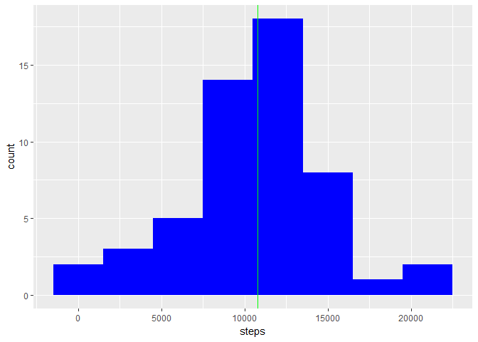
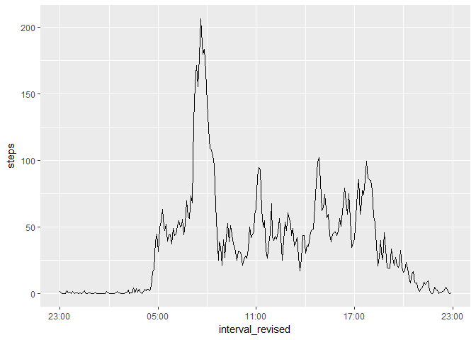
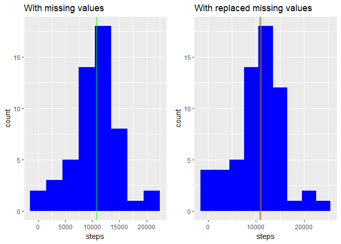
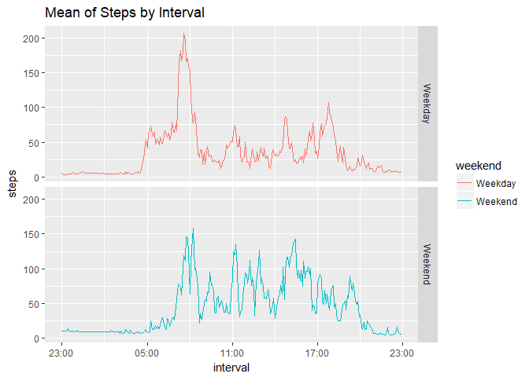

## Loading and preprocessing the data
It does not seem that we need some extra preparation of data. Just check if the file has already been downloaded and, if not, download, unzip and afterwards read it.

```r
#download the data
strFName <- "Activity.zip"
if (!file.exists(strFName)){
  strFile <- "https://d396qusza40orc.cloudfront.net/repdata%2Fdata%2Factivity.zip"  
  download.file(strFile,strFName)
  unzip(strFName)
}

strFName <- "activity.csv"
dsSource = read.csv(strFName)

#convert intervals into time scale
dsSource$interval_revised <- sprintf("%04d", dsSource$interval)
dsSource$interval_revised <- paste(  substr(dsSource$interval_revised,1,2),
                                     substr(dsSource$interval_revised,3,4),
                                     sep = ":")
dsSource$interval_revised <- as.POSIXct(strptime(dsSource$interval_revised, format="%H:%M"))
```

## What is mean total number of steps taken per day?
First we calculate number of steps made each day in our dataset:

```r
dsStepsPerDay <- aggregate(steps~date,data = dsSource,sum)
meanSteps <- round(mean(dsStepsPerDay$steps, na.rm = TRUE), digits=0)
medianSteps <- round(median(dsStepsPerDay$steps,na.rm = TRUE), digits=0)
```
The average number of steps per day is: 10766, median number of steps per day is 10765.

```r
g1 <- ggplot(data = dsStepsPerDay, aes(x=steps))+
      geom_histogram(fill = "blue", binwidth=3000)+
      geom_vline(xintercept = meanSteps, color="red", show.legend = T) +
      geom_vline(xintercept = medianSteps, color="green", show.legend = T)
print(g1)
```

<!-- -->

## What is the average daily activity pattern?
To do that, let's caclulate what is an average number of steps per each interval

```r
dsStepsPerInterval <- aggregate(steps~interval_revised, data=dsSource,mean)
g <- ggplot(dsStepsPerInterval, aes(x=interval_revised, y=steps))+geom_line(group=1)+
     scale_x_datetime(labels= date_format("%H:%M"))
print(g)
```

<!-- -->

It seems that we have maximum activity in the moring before 8 and then have 3 smaller peaks at 11, 15 and 18.

## Imputing missing values
1. Total number of missing values in the dataset

```r
nNA <- length(dsSource[is.na(dsSource$steps),1])
as.integer(nNA)
```

```
## [1] 2304
```

2. Chosen strategy: we take mean value for each particular interval

```r
dsNewSource <- dsSource
isNA <- is.na( dsSource$steps )
lInterval <- dsNewSource$interval_revised[isNA]
dsTemp <- data.frame(interval_revised=lInterval)
dsTemp <- merge(dsTemp,dsStepsPerInterval, by="interval_revised")
dsNewSource$steps[isNA] <- dsTemp$steps
remove(dsTemp)
summary(dsNewSource)
```

```
##      steps                date          interval     
##  Min.   :  0.00   2012-10-01:  288   Min.   :   0.0  
##  1st Qu.:  0.00   2012-10-02:  288   1st Qu.: 588.8  
##  Median :  0.00   2012-10-03:  288   Median :1177.5  
##  Mean   : 37.38   2012-10-04:  288   Mean   :1177.5  
##  3rd Qu.: 27.00   2012-10-05:  288   3rd Qu.:1766.2  
##  Max.   :806.00   2012-10-06:  288   Max.   :2355.0  
##                   (Other)   :15840                   
##  interval_revised             
##  Min.   :2018-01-01 00:00:00  
##  1st Qu.:2018-01-01 05:58:45  
##  Median :2018-01-01 11:57:30  
##  Mean   :2018-01-01 11:57:30  
##  3rd Qu.:2018-01-01 17:56:15  
##  Max.   :2018-01-01 23:55:00  
## 
```

3. Discovering the difference between the original and the modified data.
* Make a histogram of the total number of steps taken each day and Calculate and report the mean and median total number of steps taken per day. 
* Do these values differ from the estimates from the first part of the assignment? 
* What is the impact of imputing missing data on the estimates of the total daily number of steps?

### Histograms

```r
dsNewStepsPerDay <- aggregate(steps~date,data = dsNewSource,sum)
newMeanSteps <- round(mean(dsNewStepsPerDay$steps, na.rm = TRUE), digits=0)
newMedianSteps <- round(median(dsNewStepsPerDay$steps,na.rm = TRUE), digits=0)

g2 <- ggplot(data = dsNewStepsPerDay, aes(x=steps))+
      geom_histogram(fill = "blue", binwidth=3000)+
      geom_vline(xintercept = newMeanSteps, color="red", show.legend = T) +
      geom_vline(xintercept = newMedianSteps, color="green", show.legend = T)

g1 <- g1 + labs(title="With missing values")
g2 <- g2 + labs(title="With replaced missing values")

grid.arrange(g1,g2,ncol=2)
```

<!-- -->

The median number of steps changed from 10765 to 11015.
The mean number of steps has not changed (10766 / 10766).

## Are there differences in activity patterns between weekdays and weekends?

```r
dsNewSource$weekday <- weekdays(as.Date(dsNewSource$date),abbreviate = T)
dsNewSource$weekend <- ifelse(dsNewSource$weekday %in% c("Sat","Sun"),"Weekend","Weekday")
dsTemp <- aggregate(dsNewSource$steps, 
                    by=list(
                            dsNewSource$weekend, 
                            dsNewSource$interval_revised),
                    mean)
names(dsTemp) <- c("weekend", "interval","steps")
g3 <- ggplot(dsTemp, aes(x = interval, y=steps, color=weekend)) +
      geom_line() +
      facet_grid(weekend ~ .) +
      labs(title = "Mean of Steps by Interval", x = "interval", y = "steps")+
      scale_x_datetime(labels= date_format("%H:%M"))
print(g3)
```

<!-- -->
